# Pivotal Greenplum
The Pivotal Greenplum Database (GPDB) is an advanced, fully featured, open source data warehouse. It provides powerful and rapid analytics on petabyte scale data volumes. Uniquely geared toward big data analytics, Greenplum Database is powered by the world’s most advanced cost-based query optimizer delivering high analytical query performance on large data volumes.
<https://pivotal.io/pivotal-greenplum>

# Streamsets
StreamSets software delivers performance management for data flows that feed the next generation of big data applications. Its mission is to bring operational excellence to the management of data in motion, so that data continually arrives on-time and with quality, empowering business-critical analysis and decision-making.
<https://streamsets.com/>

# Kafka
Apache Kafka is an open-source stream-processing software platform developed by the Apache Software Foundation written in Scala and Java. The project aims to provide a unified, high-throughput, low-latency platform for handling real-time data feeds.
<https://kafka.apache.org/>

# Table of Contents
1. [Pre-requisites](#Pre-requisites)
2. [Starting Docker-compose](#Starting-Docker-compose)
3. [Configure Greenplum](#Configure-Greenplum)
4. [Configure Streamsets to load data into Kafka](#Configure-Streamsets-to-load-data-into-Kafka)
5. [Configure Streamsets to load data into Greenplum](#Configure-Streamsets-to-load-data-into Greenplum)

## Pre-requisites:
- [docker-compose](http://docs.docker.com/compose)
- [Streamsets docker image](https://hub.docker.com/u/streamsets/)
- [GPDB 5.x OSS docker image](https://hub.docker.com/r/kochanpivotal/gpdb5oss/)
- [Kafka docker image](https://hub.docker.com/r/wurstmeister/kafka/)

## Starting Docker-compose
Once you have cloned this repository, you can run the command  `./runDocker.sh -t usecase2 -c up`, in order to start both Greenplum, Kafka and Streamsets docker instances.

The assumption: docker and docker-compose are already installed on your machine.

### Run command to start both Greenplum and Streamsets instances
```
greenplum-streamsets kochan$ ./runDocker.sh -t usecase2 -c up
Creating network "usecase1_mynetwork" with driver "bridge"
Creating gpdbsne ... done
Creating usecase1_sdc_2 ... done
...
sdc_2    | Running on URI : 'http://streamsets-dc:18630'
sdc_2    | 2018-04-19 21:03:32,549 [user:] [pipeline:] [runner:] [thread:main] INFO  WebServerTask - Running on URI : 'http://streamsets-dc:18630'
```
### How to access Greenplum docker instance:
You can use this command `docker exec -it gpdbsne bin/bash` to access Greenplum docker instance.

For example:
```
greenplum-streamsets kochan$ docker ps
CONTAINER ID        IMAGE                           COMMAND                  CREATED             STATUS              PORTS                                                                                                                                NAMES
029ec4d1d656        wurstmeister/kafka:1.1.0        "start-kafka.sh"         About an hour ago   Up About an hour    0.0.0.0:32773->9092/tcp                                                                                                              usecase2_kafka_1
00554b4a6a7f        wurstmeister/zookeeper:3.4.6    "/bin/sh -c '/usr/sb…"   About an hour ago   Up About an hour    22/tcp, 2888/tcp, 3888/tcp, 0.0.0.0:2181->2181/tcp                                                                                   usecase2_zookeeper_1
121dc5dfb5e9        kochanpivotal/gpdb5oss:latest   "/docker-entrypoint.…"   About an hour ago   Up About an hour    0.0.0.0:5005->5005/tcp, 0.0.0.0:5010->5010/tcp, 0.0.0.0:5432->5432/tcp, 0.0.0.0:40000-40002->40000-40002/tcp, 0.0.0.0:9022->22/tcp   gpdbsne
53e55816a87c        usecase2_sdc                    "/docker-entrypoint.…"   About an hour ago   Up About an hour    0.0.0.0:18630->18630/tcp                                                                                                             usecase2_sdc_1
greenplum-streamsets kochan$

```

### How to access Streamsets docker instance:
You can use this command `docker exec -it usecase2_sdc_1 bin/bash` to access Streamsets docker instance.

For example:
```
greenplum-streamsets kochan$ docker exec -it usecase2_sdc_1 bin/bash
bash-4.3$
```

### How to access Kafka docker instance:
You can use this command `docker exec -it usecase2_kafka_1 bin/bash` to access Kafka docker instance.

For example:
```
greenplum-streamsets kochan$ docker exec -it usecase2_kafka_1 bin/bash
bash-4.4#
```

## Configure Greenplum
Once you have access to Greenplum docker instance, you can create database, table with some sample data.

1. Start GPDB instance:
Use the command 'startGPDB.sh'
```
root@gpdbsne# startGPDB.sh
SSHD isn't running
 * Starting OpenBSD Secure Shell server sshd                             [ OK ]
SSHD is running...
20180419:21:15:09:000094 gpstart:gpdbsne:gpadmin-[INFO]:-Starting gpstart with args: -a
20180419:21:15:09:000094 gpstart:gpdbsne:gpadmin-[INFO]:-Gathering information and validating the environment...
...
20180419:21:15:18:000247 gpstart:gpdbsne:gpadmin-[INFO]:-Have lock file /tmp/.s.PGSQL.5432 and a process running on port 5432
20180419:21:15:18:000247 gpstart:gpdbsne:gpadmin-[ERROR]:-gpstart error: Master instance process running
```
2. Create database and table with sample database
The scripts to create database and sample data is found at `/code/usercase2/data`.

Next, run the command '/code/usecase2/data/setupDB.sh'
```
root@gpdbsne:/# /code/usecase2/data/setupDB.sh
psql:./gpdb_sample.sql:2: NOTICE:  table "usertable" does not exist, skipping
DROP TABLE
CREATE TABLE
root@gpdbsne:/#
```

3. Verify database and table is created.
Use the command `su - gpadmin`, followed by `psql -U gpadmin -d streamsets_db -c "select count(*) from usertable;"`.  The result shows no records are yet created.

Example:
```
root@gpdbsne:/code/usecase2/data#su - gpadmin
$
$ psql -U gpadmin -d streamsets_db -c "select count(*) from usertable;"
 count
-------
     0
(1 row)
```

## Configure Streamsets to load data into Kafka
1. Access [Streamsets console](http://localhost:18630/) via browser

2. Use `admin` as username and `admin` as password
You should view the console as shown in the screenshot below.
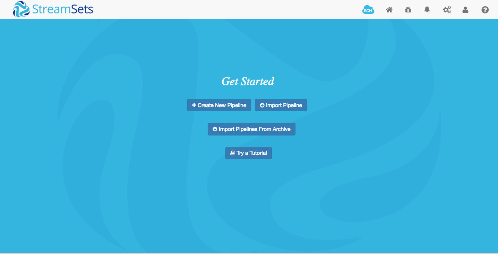

3. You can import existing pipeline from this [file](streamsets/Load data into Kafka.json).
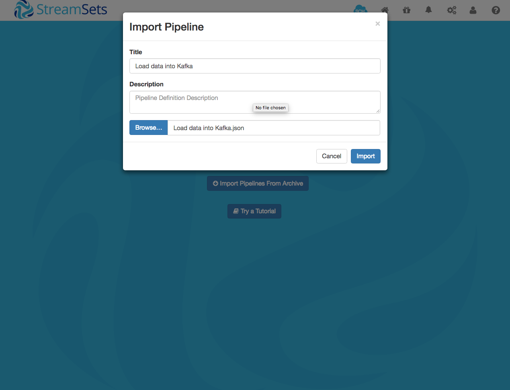
4. Your Streamsets console will show these pipeline with Kafka.
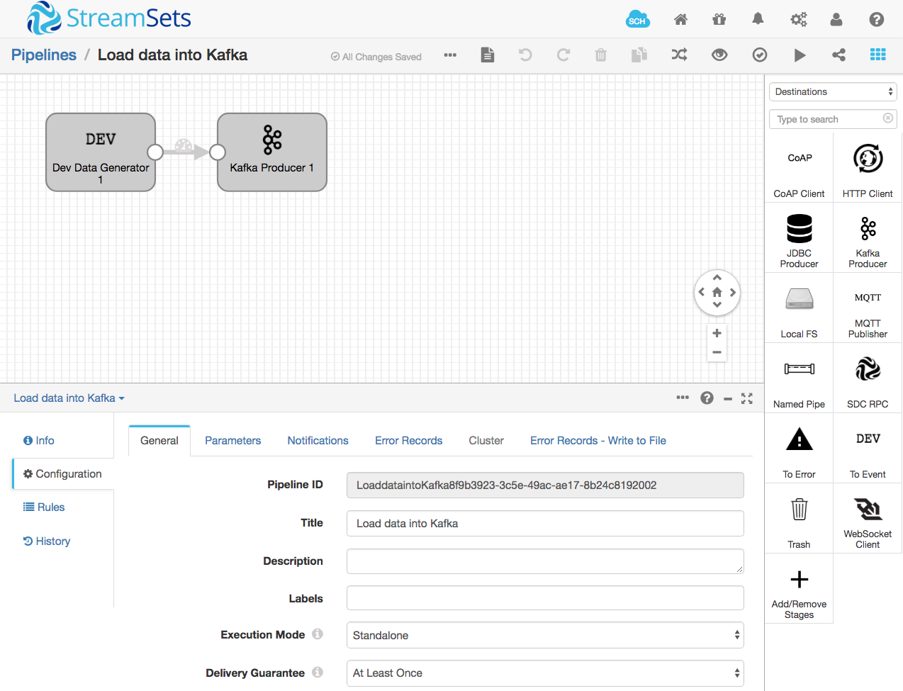
5. Click "start" icon on the top right-sized menu, in order to run the pipeline.
The pipeline shows records that are processed , number of records inserted per second.
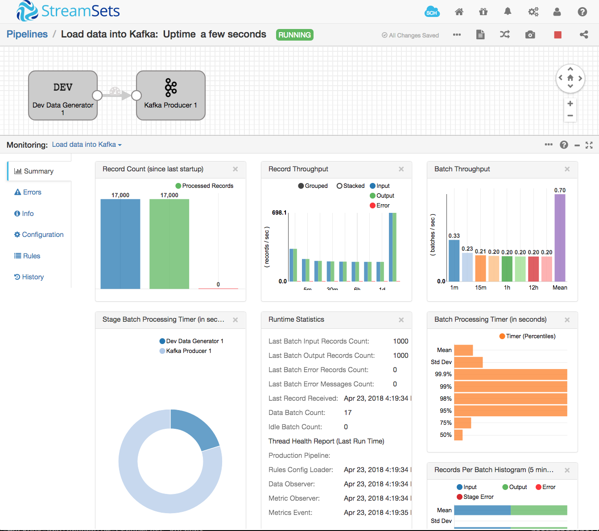

## Configure Streamsets to load data into Greenplum
1. Access [Streamsets console](http://localhost:18630/) via browser

2. Use `admin` as username and `admin` as password
You should view the console as shown in the screenshot below.


3. Next, click on the package manager as shown on top right menu.
You can install the JDBC stage library by checking the checkbox and press the `+` icon, in order to install the library.
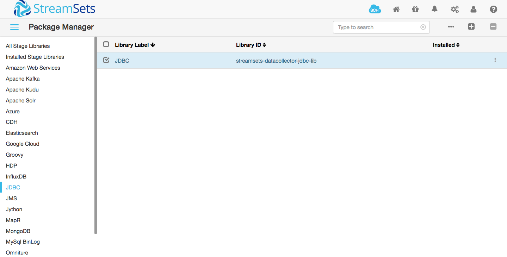
4. Install Postgresql JDBC driver by clicking on "external Libraries" under [Package Manager](http://localhost:18630/collector/packageManager). The link to external manager is shown at the bottom of left menu.
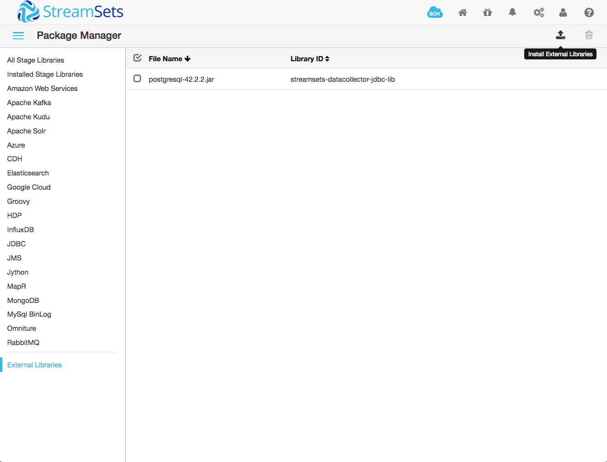
For more details, [how to download JDBC driver - see this script download_postgresql.sh](data/download_postgresql.sh)
5. You can import existing pipeline from this [file](LoaddataintoGreenplum04c676c9-faa7-49de-a6df-d135befd4f3a.json).

6. Your Streamsets console will show these pipeline that included Dev data generator and JDBC Producer.
The Dev Data generator generates 3 fields such as lastname (string), firstname (string) and age (integer). By default, it generates a batch size of 1000 records and delay between batches is 1000 ms.
The JDBC Producer is configured to use this JDBC connection string `jdbc:postgresql://gpdbsne:5432/streamsets_db` with username `gpadmin` and password `pivotal`
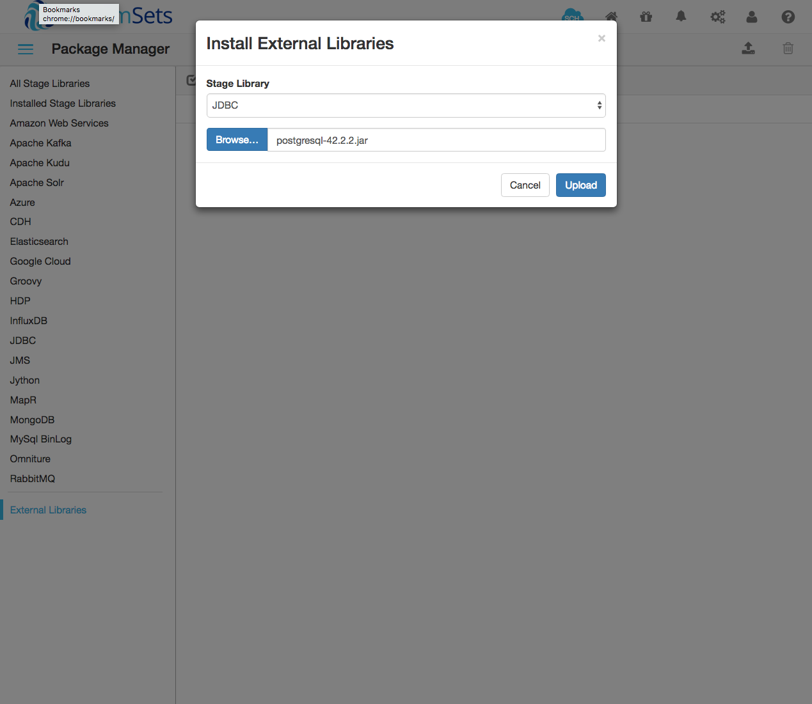
8. Click "start" icon on the top right-sized menu, in order to run the pipeline.
The pipeline shows records that are processed , number of records inserted per second.


## Configure Streamsets to load data into Greenplum
1. Access [Streamsets console](http://localhost:18630/) via browser

2. Use `admin` as username and `admin` as password
You should view the console as shown in the screenshot below.


3. Install Postgresql JDBC driver by clicking on "external Libraries" under [Package Manager](http://localhost:18630/collector/packageManager). The link to external manager is shown at the bottom of left menu.
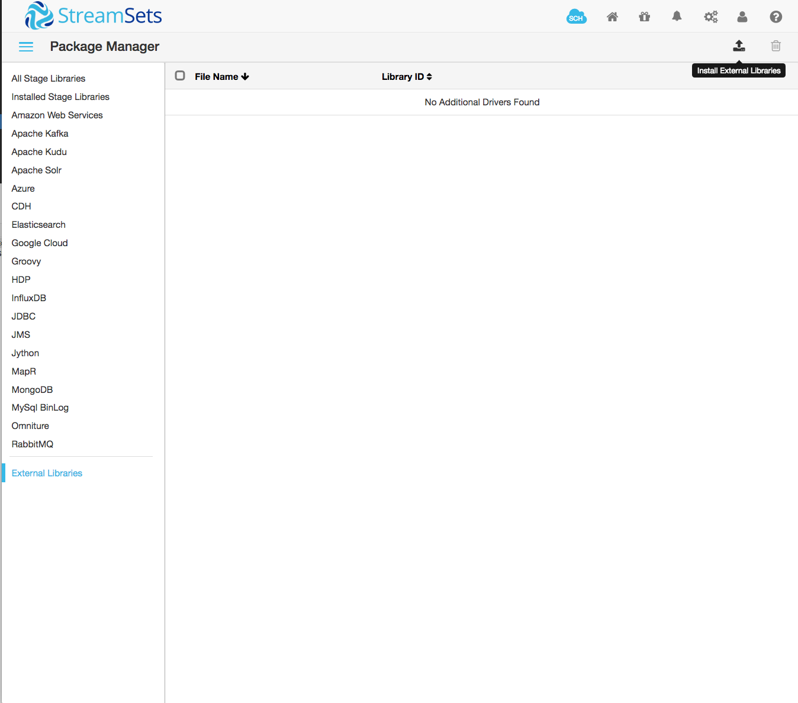

For more details, [how to download JDBC driver - see this script download_postgresql.sh](data/download_postgresql.sh)
5. You can import existing pipeline from this [file](streamsets/Loading data from Kafka into GPDB.json).
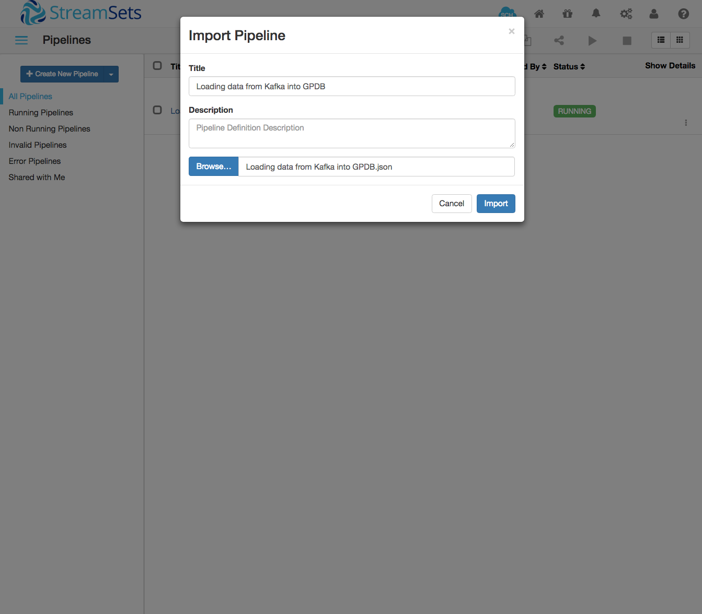
6. Your Streamsets console will show these pipeline
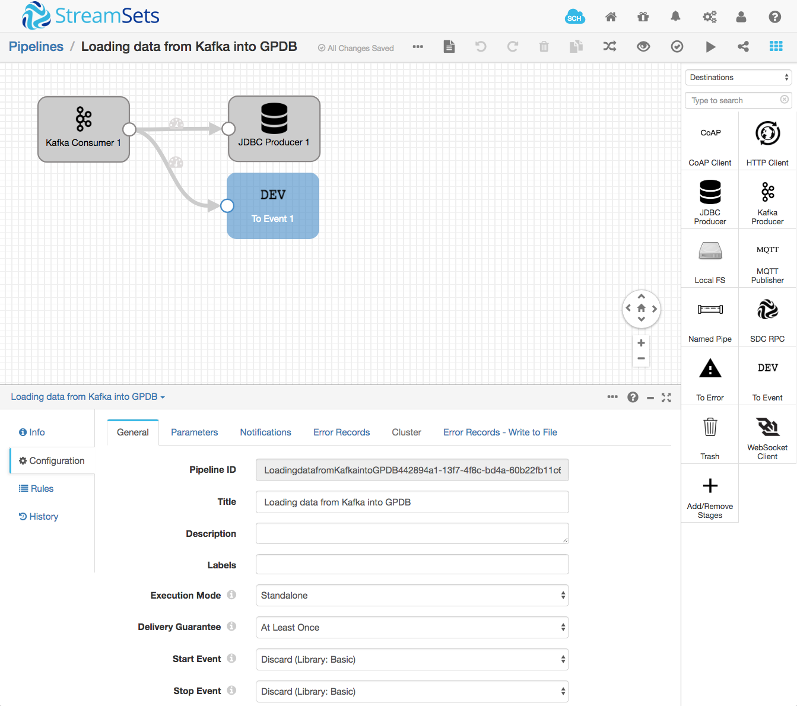

7. Click "start" icon on the top right-sized menu, in order to run the pipeline.
The pipeline shows records that are processed , number of records inserted per second.
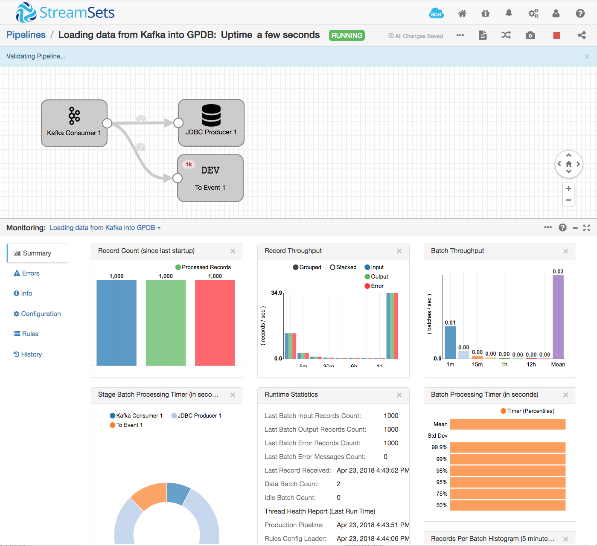
9. You can verify the data is stored in GPDB by executing 'select count(*) from usertable;'

```
$ /code/usecase1/data/Showusertable.sh
Running :psql -h gpdbsne -U gpadmin -d streamsets_db -c "select count(*) from usertable;"
  count
---------
 2670000
(1 row)
```
